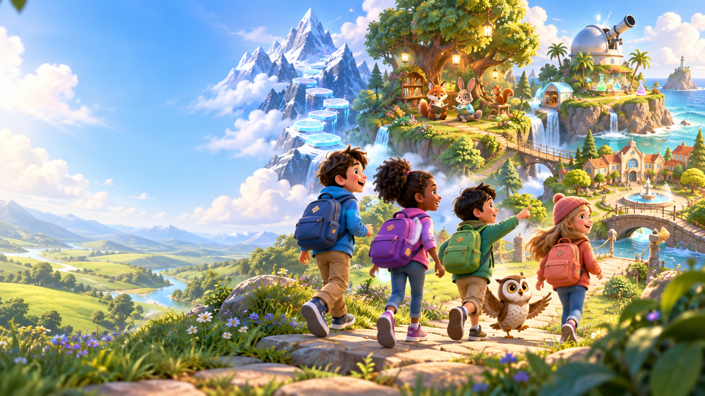
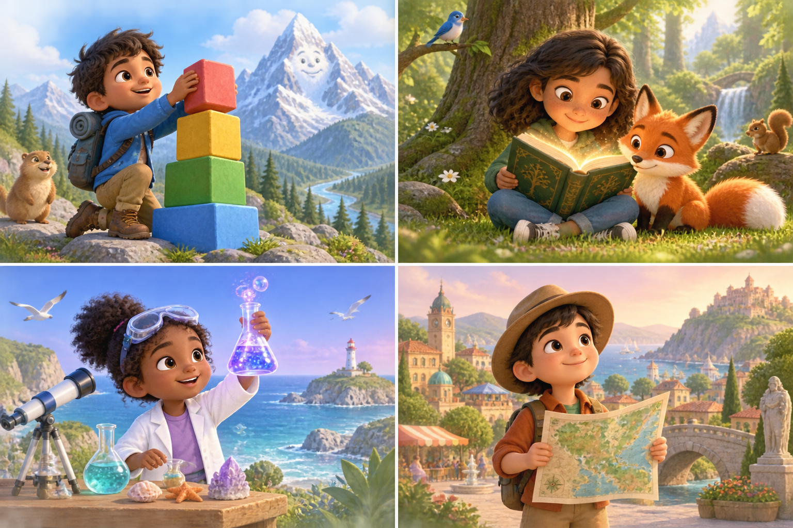
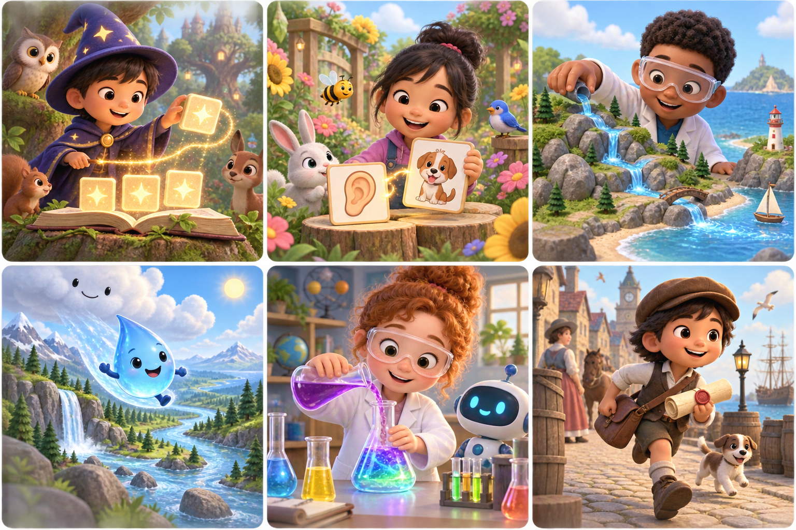
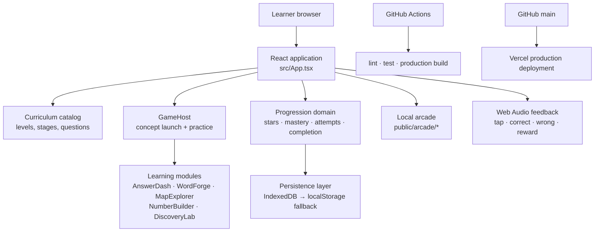

# Game School

<p align="center"><strong>A local-first K–5 learning world where a lesson feels like a level and growth is celebrated through play.</strong></p>

<p align="center">
  <a href="https://game-school-alpha.vercel.app/">Live app</a> ·
  <a href="#how-it-works">How it works</a> ·
  <a href="#architecture">Architecture</a> ·
  <a href="#development">Development</a> ·
  <a href="CONTRIBUTING.md">Contributing</a>
</p>

<p align="center">
  <a href="https://github.com/shobhit1kapoor/game-school/actions/workflows/ci.yml"></a>
  
  
  
  
  
</p>

<p align="center"></p>

## Table of contents

- [Why Game School](#why-game-school)
- [Product preview](#product-preview)
- [How it works](#how-it-works)
- [Curriculum and learning model](#curriculum-and-learning-model)
- [Game arcade](#game-arcade)
- [Architecture](#architecture)
- [Data, privacy, and safeguarding](#data-privacy-and-safeguarding)
- [Development](#development)
- [Quality engineering](#quality-engineering)
- [Deployment](#deployment)
- [Repository guide](#repository-guide)
- [Contributing and security](#contributing-and-security)
- [Project status and roadmap](#project-status-and-roadmap)

## Why Game School

Game School is a browser-based learning platform designed for Kindergarten through Grade 5. It translates a familiar school model into a clear game journey:

| School idea | Game School equivalent |
| --- | --- |
| Grade | A learner’s current school stage: Kindergarten, 1, 2, 3, 4, or 5 |
| Subject | A themed world: Math Mountain, Story Forest, Discovery Island, or Community Town |
| Class / lecture | One concept lesson with an explanation, worked thinking, vocabulary, a guided check, and practice |
| Practice | A calm, ten-part interactive round |
| Unit / stage | Two connected lessons plus a subject-game checkpoint |
| Exam | Optional high-score play in a subject arcade game—not a locked gate |
| Report card | Local mastery, stars, completed lessons, badges, and a friendly demo leaderboard |

The product design intentionally favors **free exploration** over forced unlocks. Lessons and arcade games are available to explore at any time; progress gives a learner useful guidance instead of blocking curiosity.

## Product preview

### Four subject worlds

<p align="center"></p>

| World | Subject | Learning focus |
| --- | --- | --- |
| ⛰️ Math Mountain | Math | Number sense, operations, geometry, measurement, data, and reasoning |
| 📖 Story Forest | English / ELA | Phonics, fluency, vocabulary, comprehension, grammar, writing, and research |
| 🔭 Discovery Island | Science | Observation, life science, matter, Earth systems, energy, and engineering |
| 🏛️ Community Town | Social Studies | Community, maps, geography, history, civics, culture, and economics |

### Local game arcade

<p align="center"></p>

The arcade is intentionally separate from lessons. A learner can play a game at any time, while a completed stage makes the game checkpoint especially visible as a way to apply learning and pursue a personal high score.

## How it works

```text
Choose grade → choose subject world → choose a stage and lesson
                                              ↓
                     concept launch: big idea · worked thinking · strategy · vocabulary
                                              ↓
                       guided check → 10-part interactive practice → feedback
                                              ↓
                   stars + local mastery + optional stage-game checkpoint
```

### A lesson’s interaction contract

Every lesson follows the same predictable, learner-friendly sequence:

1. **Concept launch** — explains the concept in age-appropriate language.
2. **Worked thinking** — models one way to reason through the idea.
3. **Strategy and vocabulary** — offers reusable language and a concrete thinking routine.
4. **Try it together** — gives immediate visual and audio feedback on a low-stakes guided question.
5. **Ten-part practice** — runs an interactive round with correct/incorrect feedback, no hard countdown, and replay support.
6. **Reflection through progress** — stores the attempt, recalculates mastery, awards stars when earned, and updates the learner’s local profile.

### Reward model

| Event | Learner feedback |
| --- | --- |
| Opening a concept lesson for the first time | 1 learning star |
| Completing practice with at least 60% accuracy | Completion stars plus accuracy and calm-speed bonuses |
| Correct / incorrect answer | Distinct visual state and positive / corrective sound cue |
| Completing both lessons in a stage | A highlighted subject-game checkpoint |
| Ongoing learning | Local badges, stars, completed-lesson count, and a friendly demo leaderboard |

## Curriculum and learning model

### Content shape

Game School currently models a complete learning **journey structure** for six grades and four subjects:

| Metric | Current implementation |
| --- | ---: |
| Grades | 6 — Kindergarten through Grade 5 |
| Subjects | 4 |
| Lessons per subject per grade | 10 |
| Lessons per grade | 40 |
| Guided stages per subject | 5 |
| Practice parts per lesson | 10 |
| Packaged arcade games | 14 |

That is **240 named lessons** organized into **120 subject stages**. The content catalog is data-driven: titles, stage syllabi, concept explanations, example language, strategies, vocabulary, and question sets live in `src/content/catalog.ts`.

### Grade progression

The catalog raises vocabulary, abstraction, and problem complexity across grades. Math moves from counting, comparing, shapes, and patterns in Kindergarten to decimal operations, coordinate reasoning, fraction strategies, volume, data, expressions, and geometry in Grade 5. Similar progression exists in ELA, Science, and Social Studies.

> **Curriculum note:** Game School is built around broadly recognizable U.S. K–5 learning progressions. It is not yet a standards-certified curriculum or a substitute for district-approved scope and sequence. Before classroom adoption, map each lesson to the relevant state or district standards, validate question quality with educators, and run accessibility and child-safety reviews.

### Stage syllabi

Each subject uses the same five-stage rhythm in every grade while lesson titles and question sets rise in difficulty.

| Math | English / ELA | Science | Social Studies |
| --- | --- | --- | --- |
| Number Trail | Sound Grove | Wonder Shore | Community Square |
| Operation Ridge | Reading Trail | Life Lagoon | Map Market |
| Shape Pass | Story Clearing | Matter Cove | History Lane |
| Measure Meadow | Sentence Workshop | Earth Lookout | Civic Hall |
| Problem Peak | Author Canopy | Design Dock | World Festival |

## Game arcade

All arcade experiences ship as local static files under `public/arcade/`. They use the shared Game School HUD and do not request a separate game login.

| Subject | Game | Local route |
| --- | --- | --- |
| Math | Number Road | `/arcade/number-road/index.html` |
| Math | Puzzle Playground | `/arcade/mathivities/index.html` |
| Math | Deep Sea Numbers | `/arcade/ocean-math-quest/index.html` |
| Math | Multiply Island | `/arcade/multiply-island/index.html` |
| Math | Number Nest | `/arcade/number-nest/index.html` |
| English | Word Wizard | `/arcade/wordquest/index.html` |
| English | Sound & Picture | `/arcade/pic-phonics/index.html` |
| Science | Water Workshop | `/arcade/flowspark-kids/index.html` |
| Science | Water Drop Journey | `/arcade/follow-the-drop/index.html` |
| Science | Science Mix Lab | `/arcade/chemicraft/index.html` |
| Social Studies | History Delivery | `/arcade/time-travel-courier/index.html` |
| Social Studies | World Chase | `/arcade/world-chase/index.html` |
| Social Studies | Time Trail | `/arcade/time-trail/index.html` |
| Social Studies | Secret History Codes | `/arcade/secret-history-codes/index.html` |

### Arcade integration rules

- Games are served from the same origin as the school app.
- The shared HUD provides a consistent Game School identity and a back action.
- There is no separate student account, vendor landing flow, or external hosted-game dependency at runtime.
- Game images and local routes are intentionally represented in the subject arcade cards rather than mixed into lesson cards.

## Architecture



### Layer responsibilities

| Layer | Primary responsibility | Key paths |
| --- | --- | --- |
| Presentation | App shell, landing experience, navigation, profile controls, views, responsive styling | `src/App.tsx`, `src/styles.css` |
| Content | Grade titles, subject labels, syllabus stages, explanations, question seeds, level factories | `src/content/catalog.ts` |
| Learning runtime | Concept launch and game-type selection | `src/games/GameHost.tsx`, `src/games/modules/` |
| Progression | Stars, mastery computation, completion states, attempt events, grade completion evaluation | `src/domain/` |
| Persistence | Local learner state with IndexedDB and resilient localStorage fallback | `src/persistence/store.ts` |
| Sound | Browser-native feedback tones for tap, correct, wrong, and reward events | `src/lib/sound.ts` |
| Arcade | Static, locally hosted game experiences and shared school HUD | `public/arcade/` |
| Delivery | Vite production build, Vercel hosting, GitHub Actions CI | `vite.config.ts`, `.github/` |

### Local state model

The application keeps learner data on the device. The primary state contains:

```ts
{
  profile: { id, name, age, avatar, selectedGrade, stars },
  attempts: AttemptEvent[],
  mastery: Record<skillId, MasteryRecord>,
  progress: Record<levelId, ProgressRecord>,
  completedToday: number
}
```

The persistence adapter uses **IndexedDB** first and falls back to **localStorage** if the database is unavailable. This keeps the core learning experience usable without a server, account, or network call after the app is loaded.

### Design decisions

- **Data-driven content, not 240 hand-built screens.** Grade and subject data produces the level catalog consistently and makes future content expansion practical.
- **No hard learning locks.** Progress recommends a next lesson but never makes curiosity wait behind an unlock gate.
- **Concept before assessment.** A guided explanation appears before the practice game in every lesson.
- **Local-first by default.** The project avoids login friction, remote learner profiles, ads, and trackers.
- **Shared game shell.** Locally packaged games remain distinct experiences while retaining a recognizable Game School frame.

## Data, privacy, and safeguarding

Game School is a local demo product, not a hosted student-information system.

| Area | Current behavior |
| --- | --- |
| Student account | No account required |
| Progress storage | Browser storage on the current device |
| Names and ages | Entered locally in the profile editor; not sent to an application server |
| Analytics / advertising | Not built into the app |
| Parent / adult view | Reads the same local progress state on the device |
| Reset | Available locally from the grown-ups view |

For any real school, classroom, or multi-user deployment, add an explicit privacy architecture before collecting or syncing learner data: authentication, consent, role-based access, data retention, incident handling, age-appropriate notices, and a review against applicable student privacy requirements.

## Development

### Prerequisites

- Node.js 22 LTS or later
- npm 10 or later
- A modern browser

### Run locally

```bash
git clone https://github.com/shobhit1kapoor/game-school.git
cd game-school
npm ci
npm run dev
```

Vite prints the local URL, normally `http://127.0.0.1:4173`.

### Useful commands

| Command | Purpose |
| --- | --- |
| `npm run dev` | Run the Vite development server |
| `npm run lint` | Run ESLint with warnings treated as failures |
| `npm run test` | Run the Vitest domain test suite |
| `npm run build` | Type-check and create the production bundle in `dist/` |

### Add a lesson safely

1. Update the relevant grade/subject lesson titles and question data in `src/content/catalog.ts`.
2. Keep each lesson’s explanation, worked example, strategy, vocabulary, and question set understandable at its grade level.
3. Confirm the level still has a 10-part round through `tenPartRound`.
4. Run lint, tests, and build.
5. Open the subject view, concept launch, and practice round in a browser.

### Add an arcade game safely

1. Place the packaged static game inside `public/arcade/<game-name>/`.
2. Add a direct `index.html` entry point and make all referenced assets local.
3. Load the shared `/arcade/brightpath-arcade.js` HUD.
4. Add the game to `ARCADE_GAMES` in `src/App.tsx` with a clear child-friendly name, card art, and local route.
5. Test the route directly and from the arcade card.

## Quality engineering

### Automated checks

The repository ships with a GitHub Actions workflow on pushes and pull requests to `main`:

```text
npm ci → npm run lint → npm run test → npm run build
```

The Vitest suite verifies core progression behavior, including correct state updates, completion logic, mastery behavior, and lesson construction expectations. Test configuration explicitly excludes packaged arcade assets and Vercel build output so only intended project tests execute.

### Manual release checklist

- [ ] Open the landing page and confirm the Game School identity and images render.
- [ ] Switch through Kindergarten and Grades 1–5.
- [ ] Visit all four subject worlds and inspect stage / lesson cards.
- [ ] Start a lesson and verify concept launch, guided check, all 10 practice parts, and completion feedback.
- [ ] Confirm correct, wrong, tap, and reward sound cues work after a user interaction.
- [ ] Open each arcade route from its card and verify its Game School HUD and back action.
- [ ] Check desktop and mobile-width layout, keyboard navigation, and readable text contrast.
- [ ] Run `npm run lint`, `npm run test`, and `npm run build`.

## Deployment

The live production site is [game-school-alpha.vercel.app](https://game-school-alpha.vercel.app/).

Vercel is connected to this GitHub repository. Production deployment uses the Vite build command and serves `dist/`; packaged arcade files are copied as static public assets. A push to `main` can therefore be deployed through the connected Vercel project.

For a custom domain, add a domain in the Vercel project dashboard and follow its DNS instructions. Do not change browser storage strategy without planning how existing local learner progress should behave.

## Repository guide

```text
.
├── .github/
│   ├── dependabot.yml          # Weekly dependency maintenance
│   └── workflows/ci.yml        # Lint, test, and build on GitHub
├── public/
│   └── arcade/                 # Self-contained, local static games
├── src/
│   ├── assets/                 # Product illustrations, covers, and logo
│   ├── content/catalog.ts      # Grades, subjects, stages, lessons, questions
│   ├── domain/                 # Types and progression rules
│   ├── games/                  # Lesson host and interactive game modules
│   ├── lib/sound.ts            # Audio feedback
│   ├── persistence/store.ts    # IndexedDB + localStorage persistence
│   ├── App.tsx                 # Product shell and primary views
│   └── styles.css              # Responsive visual system
├── CONTRIBUTING.md             # Contribution and learner-safety contract
├── SECURITY.md                 # Vulnerability and privacy guidance
├── vite.config.ts              # Vite application configuration
└── vitest.config.ts            # Test discovery boundaries
```

## Contributing and security

Please read [CONTRIBUTING.md](CONTRIBUTING.md) before changing content, games, learner data, or interactions. It defines the lesson, accessibility, sound, and privacy contracts that keep the product coherent.

For vulnerability reporting and the privacy boundary, see [SECURITY.md](SECURITY.md).

## Project status and roadmap

### Available now

- [x] Game School branded landing experience and subject worlds
- [x] Kindergarten–Grade 5 catalog scaffold: 240 named lessons
- [x] Four core subjects and five stage syllabi per subject
- [x] Concept-first lesson launch with guided check and 10-part practice
- [x] Local learner profile, stars, mastery, rewards, and demo leaderboard
- [x] Local arcade with 14 packaged games and a shared school HUD
- [x] Browser sound feedback
- [x] GitHub Actions CI, Dependabot configuration, Vercel production delivery

### Next professional milestones

- [ ] Educator-reviewed, standards-mapped question bank for every lesson
- [ ] Formal content versioning and migration strategy for curriculum updates
- [ ] End-to-end browser tests for each bundled arcade route
- [ ] Accessibility audit with keyboard, screen-reader, reduced-motion, and color-contrast verification
- [ ] Optional secure family / classroom sync with a child-privacy design review
- [ ] Teacher dashboard, exports, assignments, and multi-learner roles
- [ ] Observability that measures product reliability without collecting unnecessary learner data

---

Built for curious learners. **One clear idea, one playful lesson, one small win at a time.**
