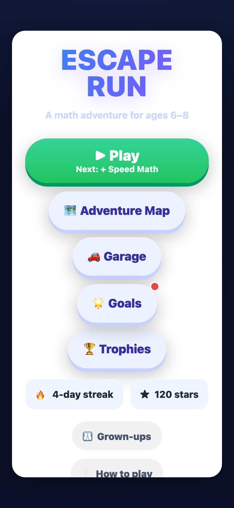
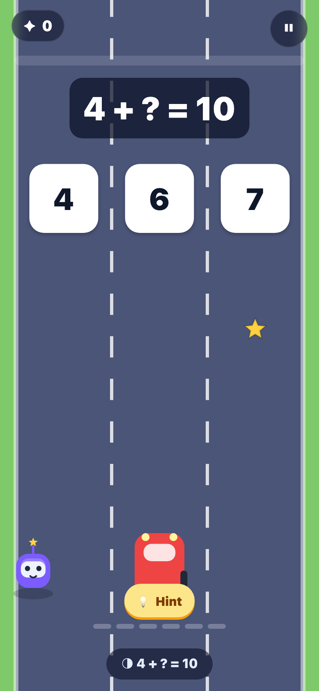
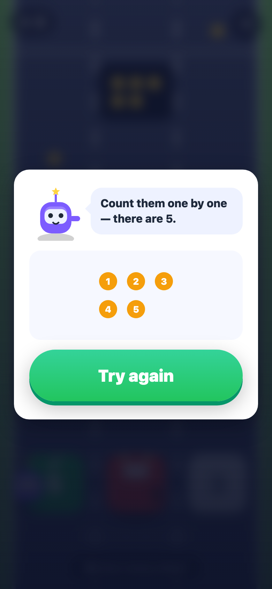
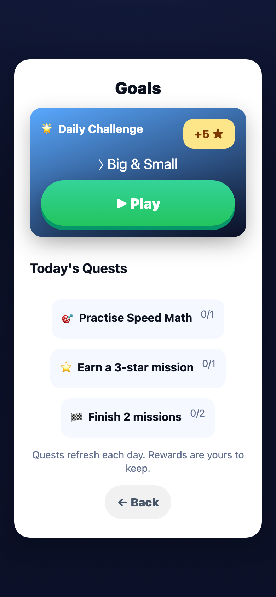
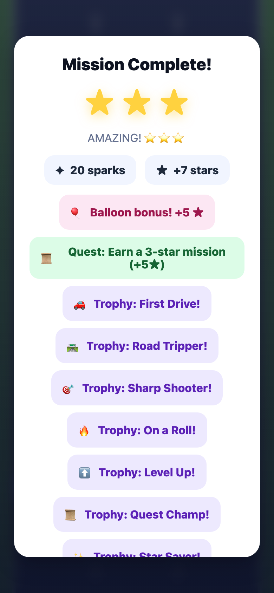
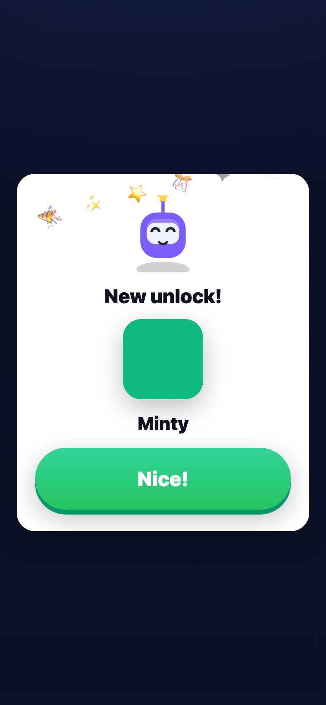

# 🏎️ Escape Run — a math adventure for ages 6–8

A free, **open-source, privacy-first** learning game where kids drive a little car
across three lanes and steer into the lane with the right answer. Five
**evidence-based** math skills, adaptive difficulty, spaced review — and
**no ads, no sign-in, no tracking**. Everything runs in the browser and works
offline.

**▶ Play:** https://abhas9.github.io/escape-run/ &nbsp;·&nbsp; **~35 KB core code** (+ ~1.5 MB lazy-loaded audio) &nbsp;·&nbsp; **zero runtime dependencies** &nbsp;·&nbsp; installable PWA

> 🤖 **Vibe-coded** — built almost entirely by prompting an AI coding agent, then
> kept honest with unit tests and headless-browser smoke tests. See
> [How it was built](#how-it-was-built).

<p align="center">
  
  
  
</p>
<p align="center">
  
  
  
</p>

---

## Why this exists

Most "free" kids' math apps are stuffed with ads, upsells, accounts, and
trackers pointed at children. I wanted the opposite: something my kid could open
and play in one tap, that respects their attention and privacy, and that's
actually grounded in how children learn math — with the whole thing open for
other parents and teachers to read, fork, and improve.

## What makes it different

- **Privacy by design.** No accounts, no analytics, no network calls. All
  progress is stored in `localStorage` on the device. Nothing ever leaves the
  browser. (Verify it yourself — open DevTools → Network.)
- **Evidence-based content.** The eight skills are chosen because they're strong,
  well-replicated predictors of early-elementary math achievement, and they map
  onto the India NCERT primary-maths curriculum (see below).
- **It teaches, not just tests.** A friendly mascot (Pip) guides a hands-on
  tutorial, explains a wrong answer with a visual and a second chance, offers
  optional hints, and gives a quick modeled example when a skill levels up.
- **Ethical stickiness, no dark patterns.** Mastery-based progression, adaptive
  difficulty, spaced review, a Daily Challenge, rotating Quests, a Trophy Room,
  and collectible characters — all *earned* and local, with *flexible* streaks
  that never punish or guilt, and no purchases ever.
- **Tiny & hackable.** Vanilla JS + Canvas, no framework, no build step. Every
  skill is a ~40-line module.
- **Accessible.** Keyboard play, reduce-motion, high-contrast, colour-blind-safe
  cues (✓/✗, not colour alone), easy-read text, and large tap targets.
- **Warm audio, still private.** Calm background music, sound effects, and a
  voiced tutorial (generated with ElevenLabs) are baked in as local files at
  build time — the browser never calls any audio API, and a procedural WebAudio
  synth fallback keeps things working if the files are absent.

## The eight skills (and the research behind them)

| Skill | In game | Why it's here |
|------|---------|---------------|
| **Subitizing / Counting** | *Number Fuel — "how many dots?"* | Instantly seeing "how many" is a unique predictor of later achievement beyond rote counting. |
| **Magnitude comparison** | *Big & Small — tap the bigger/smaller number* | Numerical magnitude is one of the **strongest single predictors** of math outcomes. |
| **Arithmetic fluency** | *Speed Math — quick add/subtract* | Fluency frees working memory for harder math. |
| **Patterning** | *What's Next? — extend the pattern* | Builds algebraic reasoning and executive function. |
| **Number bonds / make-10** | *Make It Whole — part-whole composition* | Composing/decomposing number is core number sense. |
| **Multiplication & division** | *Super Groups — equal groups, times tables, fair sharing* | Repeated addition → multiplicative thinking; the gateway to Class 2–3 maths. |
| **Shape & space** | *Shape Shadows — name shapes, corners, silhouettes, solids, equal parts* | Early geometry & spatial sense; a gentle on-ramp for the youngest players. |
| **Fractions** | *Fair Share — halves, quarters, sharing a group* | Fair-share intuition is the foundation for rational number. |

The last three roads start **locked** and open as *mystery roads* on the
Adventure Map when their prerequisites are met (e.g. Super Groups opens at Speed
Math level 4), so a child meets one new idea at a time. Unlocking one is a little
celebration of its own.

**Upper levels (6–7).** Each skill extends past its original cap for kids who
master the basics: doubles & halves and missing-number equations (`? + 4 = 9` —
early algebraic reasoning) in *Speed Math*, bridging through ten and
place-value parts (`30 + ? = 34`) in *Make It Whole*, counting in rows of ten
in *Number Fuel*, transposed-digit comparisons (34 vs 43) in *Big & Small*, and
descending & two-attribute patterns in *What's Next?*. Number-line estimation
(Siegler & Booth) is on the roadmap but not yet in the game.

**Curriculum mapping (India NCERT).** Each road maps onto a primary-maths strand,
so the play is transparent to parents and teachers:

| Road | NCERT strand |
|------|--------------|
| Number Fuel | Numbers 1–20 · Class 1 |
| Big & Small | Comparing Numbers · Class 1–2 |
| Speed Math | Addition & Subtraction · Class 1–2 |
| What's Next? | Patterns · Class 1–3 |
| Make It Whole | Making 10 / Number Bonds · Class 1–2 |
| Super Groups | Grouping & Sharing (× ÷) · Class 2–3 |
| Shape Shadows | Shapes & Space / Shadows · Class 1–3 |
| Fair Share | Fair Share — halves & quarters · Class 3 |

Content stays within the Class 3 ceiling on purpose: no remainders, no fractions
beyond halves/quarters, tables to ten.

**How difficulty, review & feedback work**

- **Adaptive difficulty (ZPD).** Each skill levels up after a short run of
  successes and gently eases back after repeated misses, keeping the child in
  the "just-right" zone (Vygotsky's zone of proximal development).
- **Mastery, not grinding.** Progress reflects demonstrated understanding
  (Bloom's mastery learning), not time spent.
- **Spaced review.** A Leitner-style scheduler resurfaces skills as they come
  *due*, distributing practice over time (the spacing effect).
- **Teach, don't just test.** Wrong answers get a friendly visual explanation
  and a second chance; an optional hint appears only when a child hesitates
  (not on every question); a quick modeled example appears when a skill levels
  up ("I do / we do / you do"; Shute's formative feedback).

**Staying engaged (ethically)**

- **Onboarding** with a mascot (Pip) who then rides along and reacts.
- **"Play" rotates** through skills and shows which one is next.
- **Daily Challenge** — one date-seeded mission a day with a bonus.
- **Quests** — three rotating goals that refresh daily.
- **Balloon-pop bonus round** after every mission for extra stars.
- **Trophy Room** — sticky achievement badges.
- **Collectible characters, cars & worlds** with a celebratory earned reveal.
- **Grown-up controls** — adjustable car speed (Relaxed/Steady/Normal), break
  reminders, and accessibility toggles.
- All *earned* and local; streaks never punish; nothing is ever purchasable.

*Selected references:* Bloom, *Learning for Mastery* (1968); Vygotsky, *Mind in
Society* (1978); Cepeda et al., *Distributed practice* (Psych. Bulletin, 2006);
Siegler & Booth on number-line estimation; Rittle-Johnson on patterning;
Schneider et al. meta-analysis on magnitude comparison. Full write-up in the
in-game **Grown-ups** panel.

## Play

- **Touch:** tap the left / middle / right of the screen to change lane, or swipe.
- **Keyboard:** `←`/`→` (or `A`/`D`) to move, `1`/`2`/`3` to jump to a lane,
  `P` or `Esc` to pause.
- Collect ✦ sparks, dodge cones, and drive into the lane with the correct answer.

## Run it locally

No build step. Any static server works:

```bash
python3 -m http.server 8000    # then open http://localhost:8000
# or: npx serve .
```

## Regenerating the audio (optional)

Music, SFX, and tutorial narration are pre-generated and committed under
`assets/audio/`, so you don't need to regenerate them to play. To rebuild them
(e.g. to tweak prompts), set `ELEVENLABS_API_KEY` in a local `.env` (git-ignored)
and run:

```bash
node tools/gen-audio.mjs           # regenerates only missing files
node tools/gen-audio.mjs --force sfx:correct   # force one asset
```

Generation happens **at dev time only**; the shipped game plays local files.

## Tests

Pure game logic (skill generators, mastery model, spaced-repetition scheduler)
is covered by Node's built-in test runner — **no dependencies required**:

```bash
node --test
```

Optional browser smoke tests live in `tests/smoke.mjs` and `tests/nav.mjs`
(they drive a local Chrome via `puppeteer-core`, which is *not* a runtime
dependency).

## Project layout

```
index.html            entry point (canvas + DOM overlay)
manifest.webmanifest  PWA metadata
sw.js                 service worker (offline)
src/
  engine/   loop · input · renderer · audio (files + WebAudio synth) · voice · particles
  game/     runner · gates · hud · mascot · onboarding · teach · map · garage
            goals · trophies · balloons · reveal · results · parent zone
  skills/   counting · comparison · arithmetic · patterning · bonds
  progress/ mastery (ZPD) · scheduler (Leitner) · daily · quests · achievements
            save · settings
  ui/       styles · DOM helpers
assets/     icons · audio/ (music · sfx · voice, generated)
tools/      gen-audio.mjs (dev-only ElevenLabs generator)
tests/      unit tests (node --test) + optional browser smoke tests
```

## Add your own skill in ~40 lines

Every skill is a small pure module that returns a challenge. Create
`src/skills/myskill.js`:

```js
import { randInt, makeOptions } from "../util.js";

export const meta = {
  id: "myskill", name: "My Skill", short: "My Skill",
  icon: "?", color: "#0ea5e9", maxLevel: 5, blurb: "What this teaches.",
};

// `rng` is a 0..1 function (seedable for tests). Return exactly 3 options.
export function generate(level, rng) {
  const answer = randInt(rng, 1, level * 3);
  const { options, correctIndex } = makeOptions(rng, answer, [answer + 1, answer - 1, answer + 2]);
  return {
    skillId: "myskill",
    level,
    prompt: { type: "expr", text: `${answer} = ?` }, // reuse a render type
    optionKind: "number",
    promptText: "Pick the number",
    say: "Pick the number",
    options,
    correctIndex,
  };
}
```

Register it in `src/skills/index.js` (add to `SKILLS` and `SKILL_ORDER`), give it
a default entry in `src/progress/save.js` (`SKILL_IDS`), and — so it's playable
right away — add its id to `BASE_UNLOCKED` in `src/progress/unlocks.js` (or give
it an unlock rule to make it a *mystery road*). It then automatically gets
adaptive difficulty, spaced review, a map card, and results tracking.

## How it was built

Escape Run was **vibe-coded** — designed and written almost entirely by
prompting an AI coding agent in natural language, iterating feature by feature
(gameplay, the eight skills, adaptive difficulty and spaced repetition, the
mascot-guided tutorial, teaching feedback, the daily/quests/trophies loop, and
the ElevenLabs-generated audio).

To keep that honest rather than hand-wavy:

- The game logic is covered by **`node --test`** unit tests (skill generators,
  mastery model, spaced-repetition scheduler, skill rotation, quests,
  achievements).
- Whole-game flows are checked with **headless-Chrome smoke tests**.
- It's deliberately **small, framework-free, and readable** — every skill is a
  ~40-line module — so you can audit or fork any part of it.

Judge it on the result: tiny, tested, private, and hackable.

## Privacy

Escape Run collects **nothing**. There are no accounts, no ads, no third-party
scripts, and no network requests after the initial load (the service worker even
lets it run fully offline). Progress lives only in this browser's
`localStorage`, and the **Grown-ups → Reset progress** button clears it.

## License

[MIT](LICENSE) © abhas9. Built for kids and their grown-ups — fork away.
